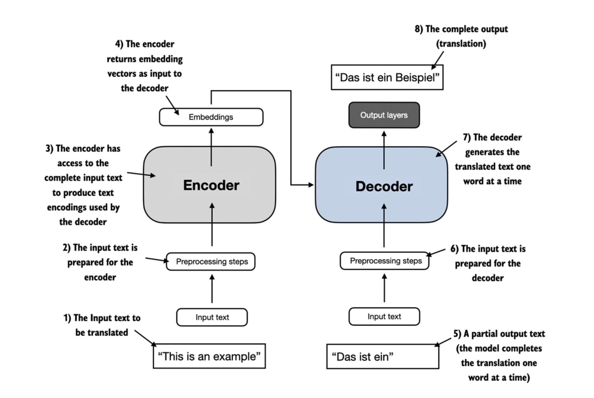
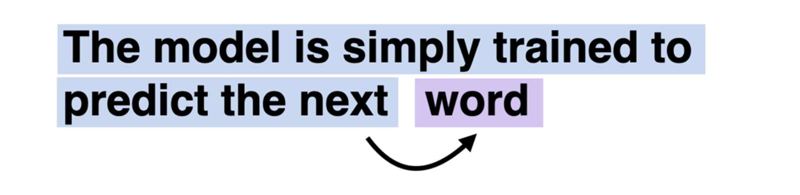
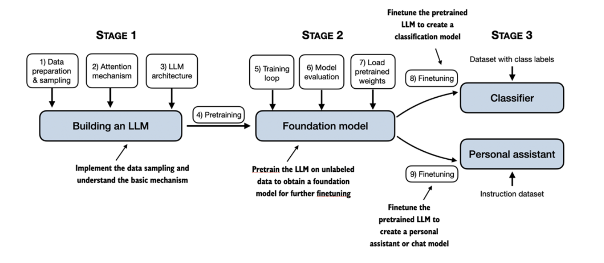

## Understanding Large Language Models

---

- LLMs utilize an architecture called the transformer
  which allows them to pay selective attention to different parts of the input when
  making predictions

- Since LLMs are capable of generating text, LLMs are also often referred to as a form of generative artificial intelligence (AI), often abbreviated as generative AI or GenAI.

- Instead of manually writing rules to identify spam emails, a machine learning algorithm is fed
  examples of emails labeled as spam and legitimate emails. By minimizing the error in its
  predictions on a training dataset, the model then learns to recognize patterns and
  characteristics indicative of spam, enabling it to classify new emails as either spam or
  legitimate.
  As illustra

- PreTraining vs Finetuning
- PreTrained -> Foundational Model

- Research has shown that when it comes to modeling performance, custom-built LLMs
  those tailored for specific tasks or domains can outperform general-purpose LLMs, such as
  those provided by ChatGPT, which are designed for a wide array of applications.

- The two most popular categories of finetuning LLMs include **instruction-finetuning** and
  finetuning for **classification** tasks.

      - In instruction-finetuning, the labeled dataset consists of instruction and answer pairs, such as a query to translate a text accompanied by the correctly translated text.
      - In classification finetuning, the labeled dataset consists of texts and associated class labels, for example, emails associated with spam and non-spam labels.

- (Moderns) LLM rely on the Transformer Architecture, introduce by the Machine Learning Paper "Attention is all you need" - 2017. The Transformer Arch is based of two components : an Encoder and a Decoder. Both the encoder and decoder consist of many layers connected by a so-called self-attention mechanism.

**BERT** -> Masked Word Prediction
**GPT** -> Text Generation (G from Generative)

Zero Shot Prompting (No Examples) vs Few Shots Prompting (Few Examples)

---

### Data

Big Dataset with >3 Billions token, CommonCrawl (filtered) being 410 Billions

**Token** : unit of text that model reads, usually a word or root of a word, 4 to 5 letters

Scale and diversity of traiing allows models to perform on diverse tasks they have not been explicitly programmed for.

Meta's LLaMa expanded dataset to Arxiv and StackExchange

### GPT Architecture 

GPT stands for Generative Pretrained Transformer

GPT Models are trained on next-word prediction task, meaning given a set of words they predict the next one

Its a from or self-supervised learning, self-labeling. We dont collect labels for the data. Since we are looking to predict the next words we can infer, we rely on the text structure. 

**Autoregressive** : Autoregressive models incorporate their previous output as inputs for future predictions

Original Transformer : 6 Encoder/Decoder block
GPT3: 96 Transformer Layer and 175B params

GPT Architecture only use the decoder portion of the transformer, but is still capable to do language translation without being explicitely being trained for this task : **Emergent Behavior**

-> Learning the pattern 

*But it's actually very similar and making sense, it's like just predicting what's the next token more likely to be, regardless of the language*

### Steps of Building a Large Language Model

