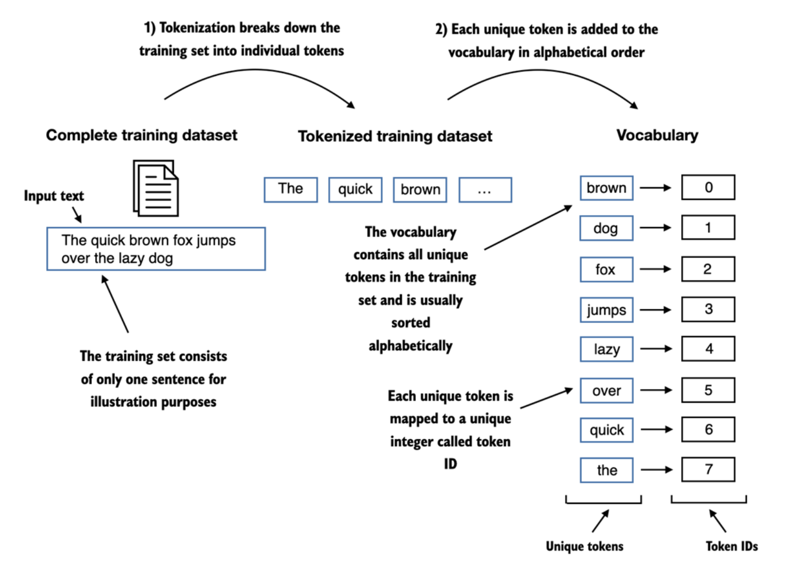
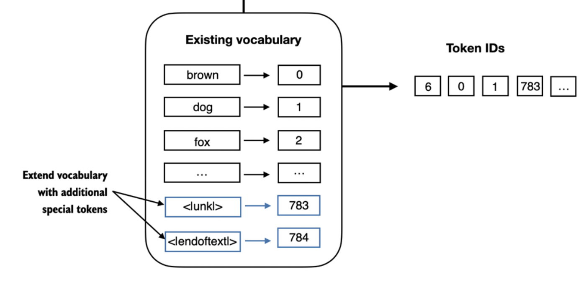
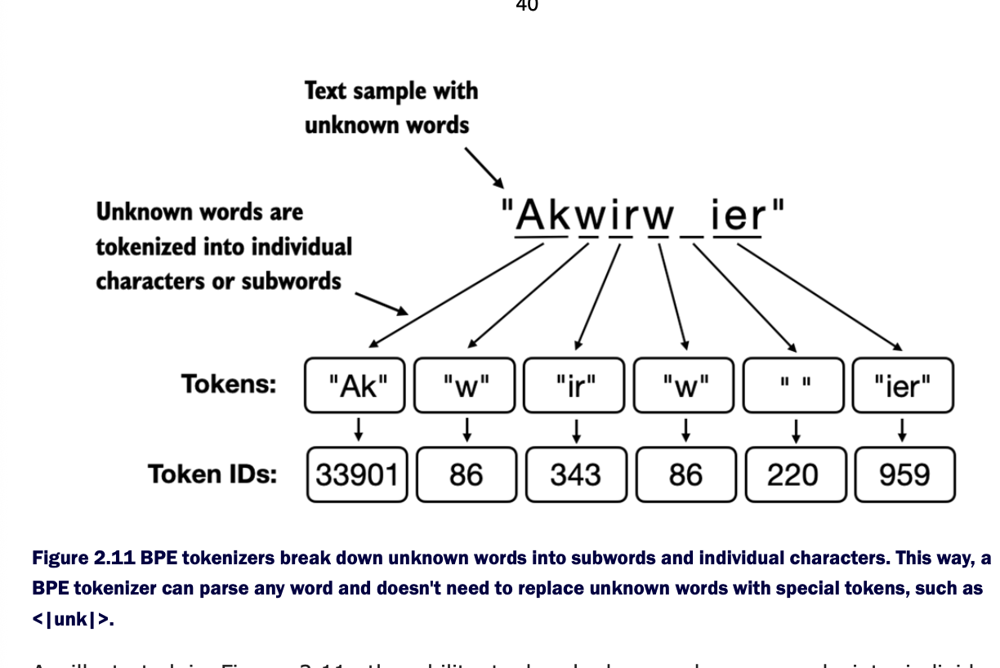
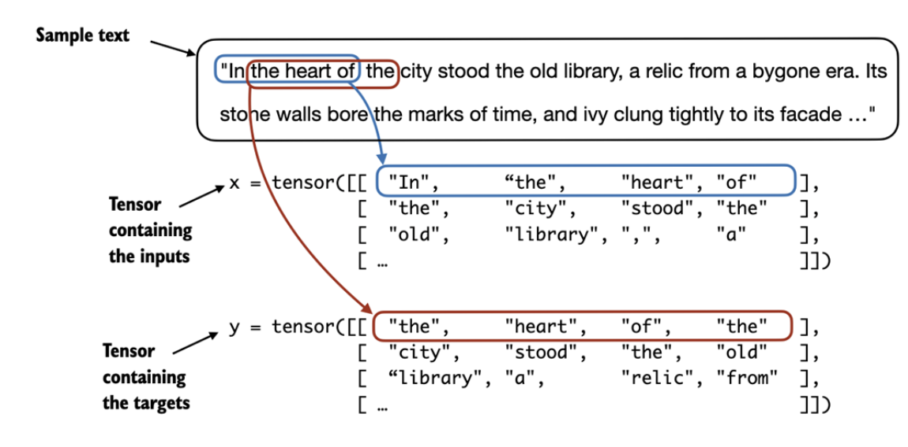
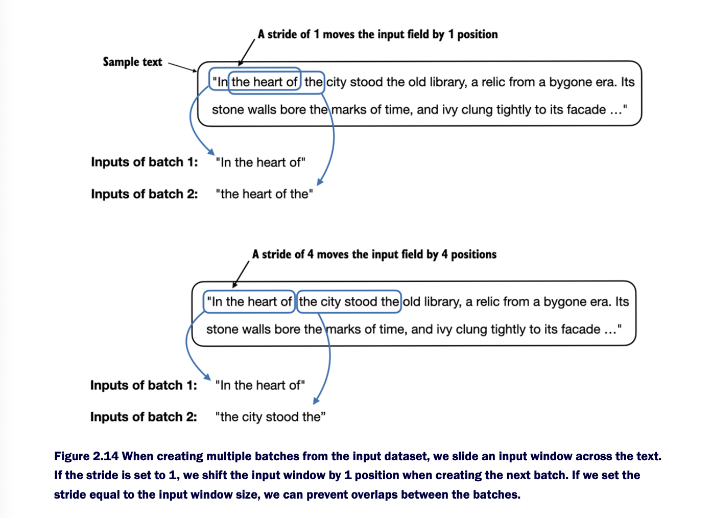
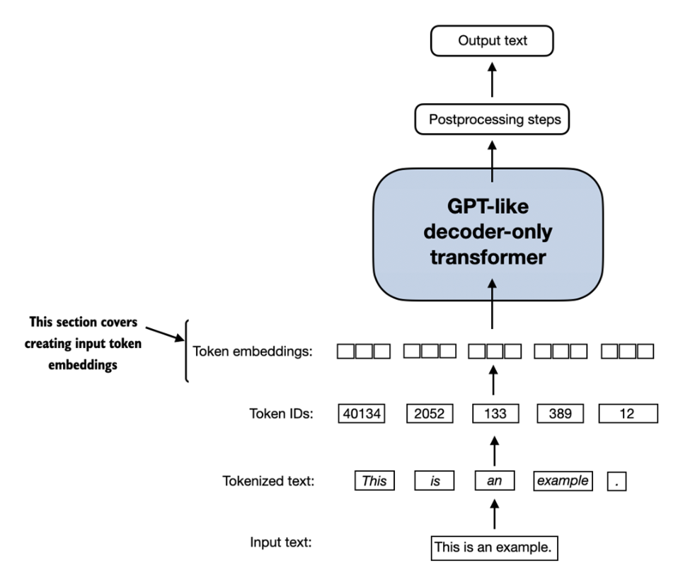

# Working with Text Data

Text Input need to be prepared for the LLM
Spitting text into individual word and subword tokens, which can then be encoded as vector representation

Reminder on Tensor


Converting data into vector is referred as embedding.
Specific Neural Network Layer of PreTrained Neural Network Model can be used (_a model in a model?_)

Different data format requires different embeddings models.

Word embedding is the most common form of text embedding, but can be done also for sentences, paragraphs or whole documents. Sentence or Paragraph embeddings are popular for RAG (Retrieval Augmented Generation)

One of earliest and popular example : **Word2Vec** &rarr; trained neural network architecture

Main idea : words that appear in similar context have similar meanings. In a 2D representation they can be clustered together. But word embeddings can have from 1 to 1000 dimensions.

While we can use pre-trained models like Word2Vec, LLMs commonly use their own embeddings as part of the input layer and they are updated during training, such that the embeddings are optimized to the specific task and data.

Hard to represent high density embeddings

Small GPT-2 : 786 Dimensions
Largest GPT3: 12,288 Dimensions

## Tokenizing text

Naive Tokenization by splitting by white spaces and punctuation. But no lowercasing or uppercasing of names as it helps the LLM to distinguish betwen proper nouns and common nouns and understand structure.

On removing whitespaces :

- Pros : Saves on memory and computing power
- Cons : Some text can be sensitive to whitespace, such as Python code

Basic Tokenizer by splitting :
`['I', 'HAD' .... '--', 'me', 'to', 'hear', 'that', ',', 'in']`

Once we have tokens we need to map them to a token which is an integer representation such that it can be understand by the model. -> This is the vocabulary




**How to handle unkown words in the vocab?**

### Adding special context tokens

`<|unk|>`
`<|endoftext|>`



`<|unk|>` represents the unknown words of the vocabulary (*but only at inference time? does embedding model training needs to fix this?*)

`<|endoftext|>` represents the end of a text, useful when LLM trained on corpus of texts, since they are being concatenated for training while being unrelated

Depending on the LLM, researches have added other tokens : 

`[BOS]`: Beginning of sequence -> Start of text
`[EOS]`: End of sequence -> End of text
`[PAD]`: Padding -> When training LLMs with batch sizes larger than one, with text smaller than other ones. Those are being padded with `[PAD]`

See Also :
`<s>` and `</s>` for sentence
`[INST]` and `[/INST]` for Instruction, in conversations


GPT Models only use `<|endoftext|>` token for simplicity. Furthermore the GPT Tokenizer does not use the `<|unk|>` unknown token as it's leveraging Byte Pair Encoding, which breaks down words into subword units.

## Byte Pair Endoding
The BPE tokenizer is capable of tokenizing unknown words by using subwords token.




This is being done by doing Bi-Gram encoding. Using a list of words, it's progressively merging every most frequent bi-gram at each training step, until it reach desired vocabulary size.

See https://docs.mistral.ai/cookbooks/concept-deep-dive-tokenization-tokenizer#bpe-and-more


## Data sampling using sliding window

Since LLMs are trained to predict next word in a sentence we need to prepare a sliding window dataloader

```
context_size = 4 # How many tokens in the input
```



Tensor size :  (text_size/context_size) by context_size ? 


a Pytorch Dataset implements 

` __init__`
`__len__`
`__getitem__`


2 Datasets are created : Train, Test.

Each will be associated to a dataloader





Stride increase to avoid overlap between the batches, more overlap could lead to increased overfitting


## Token Embeddings



Like every NN traing with backpropagation, needs to be initialized with random value.

Embeddings are an efficient way to store and encode tensor into vector space

From Claude : Why Embeddings Instead of One-Hot?

Dimensionality: One-hot vectors are huge and sparse (50,000 dimensions). Embeddings are dense and compact (typically 256-4096 dimensions).

Semantic meaning: One-hot encoding treats all words as equally different. 
Embeddings learn that "cat" and "dog" are closer than "cat" and "democracy" by placing them closer in vector space.

Trainability: The embedding values are learned parameters that improve as the model trains to solve its task.


Embedding layers perform look-up operation.
vocab_size : number of tokens in vocabulary
dimension : dimension of the vector space

The Trade-off
Too small:

Can't capture enough semantic distinctions
Words forced to share similar representations even when meanings differ

Too large:

Wasted parameters (diminishing returns)
Harder to train efficiently
May overfit on smaller datasets

Common Ratio : 1 to 5% of the vocab size


## Encoding Word Positions

Self Attention mechanism does not have notion of position or order for the tokens with a sequence.
-> In transformers, the self-attention mechanism is permutation invariant (Claude)

*Absolute Positional Embeddings* are associated with specific positions in a sequence. This is added to the vector generated by the embedding layer.

GPT-3

Each token will have a distinct positional embedding

````

Tok.  Pos
[3]   [1.1]   [4.1]
[2] + [1.2] = [3.2]
[6]   [1.3]   [7.3]


```

*Relative Positional Embeddings* associate with distance between words, eg (-2, +2)
-> Can generate/deal better with different lenght of text


Modern Days : 
Rotated Position Encoding (RoPE)
AliBi

GPT Models use absolute positional encoding and are optimized during model training