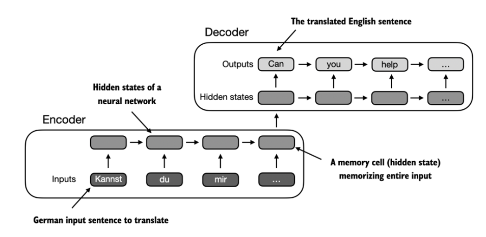
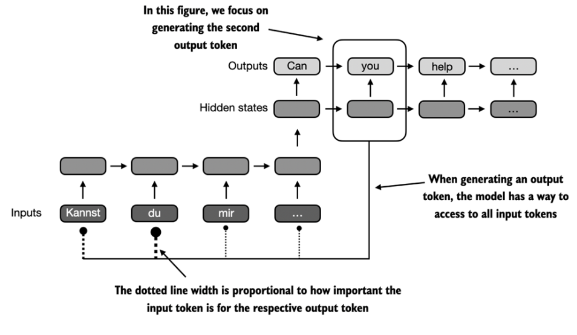

## 3.1 Problem with modeling long sequences

Self Attention

Translating word by word -> not working

Encoder/Decoder

RNN : Recurrent Neural Network
- Type of Neural Network where outputs from previous steps are fed as inputs in the current step, well suited for sequential data.

Encoder : Input to hidden states
Decoder : Hidden states to Output



Issues and limitations: 
- The RNN can not access earlier hidden states, only the current one that has all the relevant information. Leads to loss of context, especially in long and complex sentences. (Wich we stil have nowadays? Contex Rotting?)


## 3.2 

Bahdanau attention 

Bahdanau attention modifies the encoder/decoder RNN such that the decoder can access selectively different parts of the input sequence.



This selection is done using Attention Weights 

Self Attention is a mechanism that allow each position in input to attend all positions in same sequence when computing representation of a sequence.


## 3.3

### Self-Attention
-> Self refers to the mechanism ability to compute attention weights by relating the different positions within a single input sequence. Learns relationships and dependencies between the elements of the single sequence

Introspection?


Example :

For input x2 


```
1 -> t
z2 = a21*x1 + a22*x2 + a23*x3 + ... + a2t * xt
```
