## 3.1 Problem with modeling long sequences

Self Attention

Translating word by word -> not working

Encoder/Decoder

RNN : Recurrent Neural Network
- Type of Neural Network where outputs from previous steps are fed as inputs in the current step, well suited for sequential data.

Encoder : Input to hidden states
Decoder : Hidden states to Output

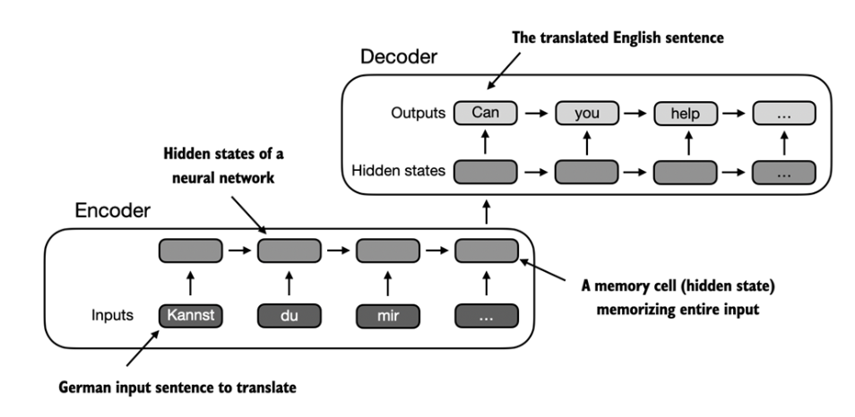

Issues and limitations: 
- The RNN can not access earlier hidden states, only the current one that has all the relevant information. Leads to loss of context, especially in long and complex sentences. (Wich we stil have nowadays? Contex Rotting?)


## 3.2 

Bahdanau attention 

Bahdanau attention modifies the encoder/decoder RNN such that the decoder can access selectively different parts of the input sequence.

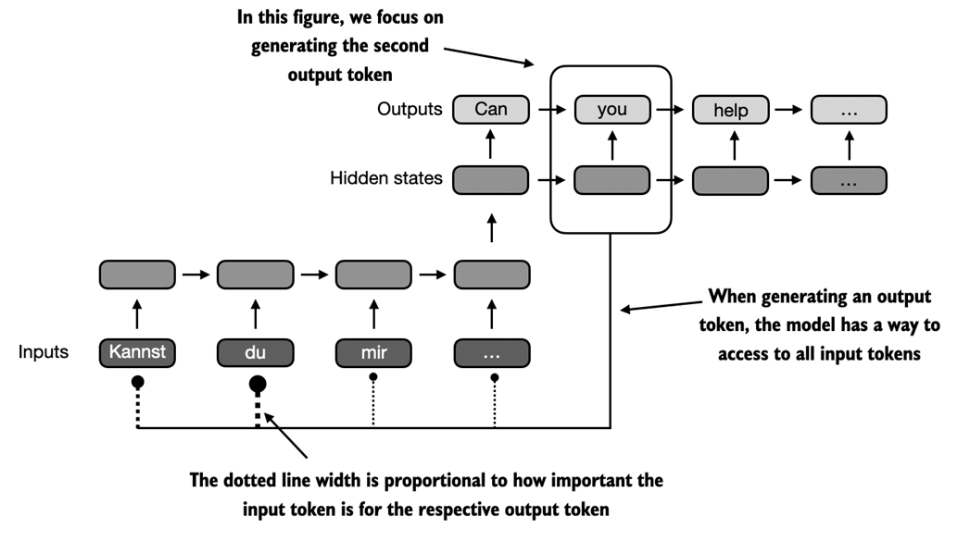

This selection is done using Attention Weights 

Self Attention is a mechanism that allow each position in input to attend all positions in same sequence when computing representation of a sequence.


## 3.3

### Self-Attention
-> Self refers to the mechanism ability to compute attention weights by relating the different positions within a single input sequence. Learns relationships and dependencies between the elements of the single sequence

Introspection?


Example :

For input x2 

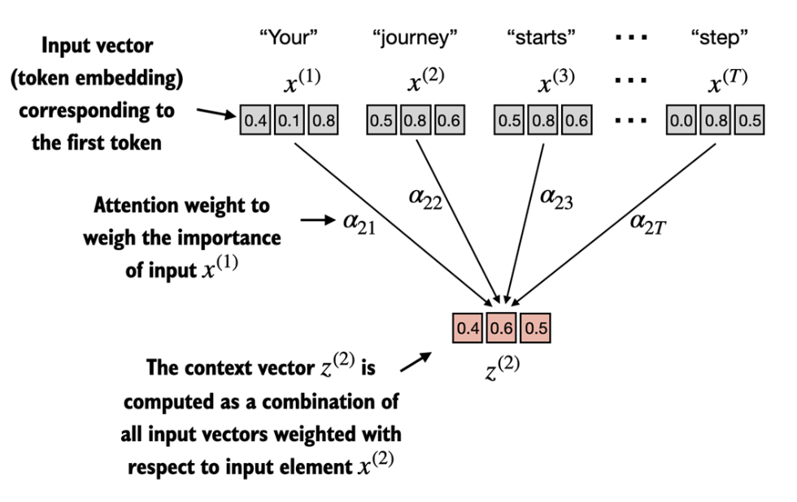

```
1 -> t
z2 = a21*x1 + a22*x2 + a23*x3 + ... + a2t * xt
```

In self-attention, our goal is to calculate context vectors z(i) for each element x(i) in the
input sequence. A context vector can be interpreted as an enriched embedding vector.


Dot Product 

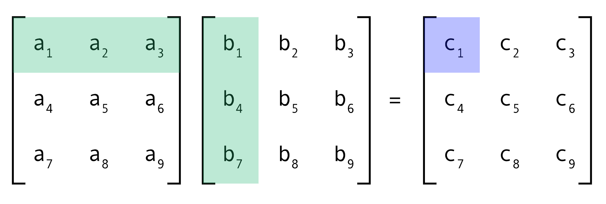

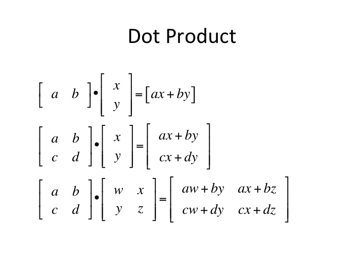

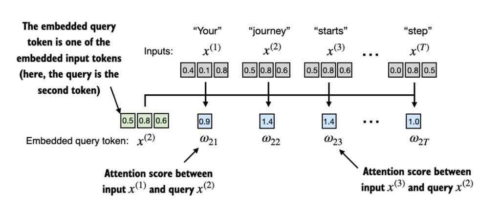

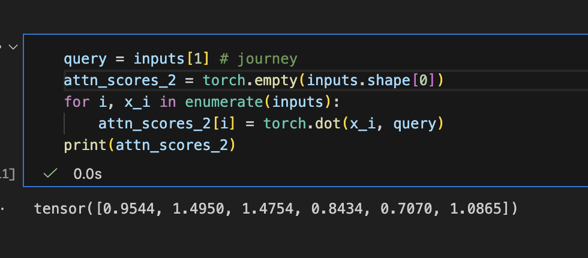

dot product between the input sequence and the query.
Higher dot product means higher similiarity. The dot product quantifies how much two vectors are aligned.

Once the attention score is computed -> we can get the attention weights by normalizing the score  such that it sums up to 1. 

Common : softmax, 
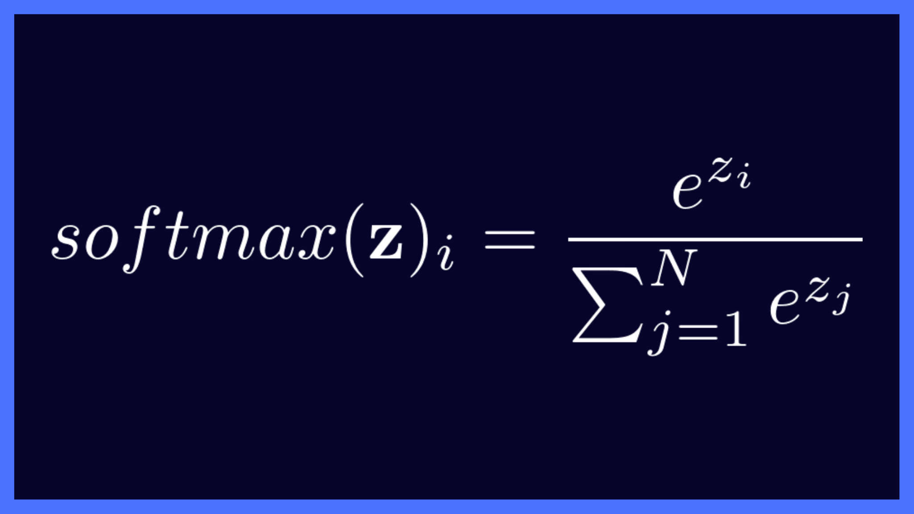

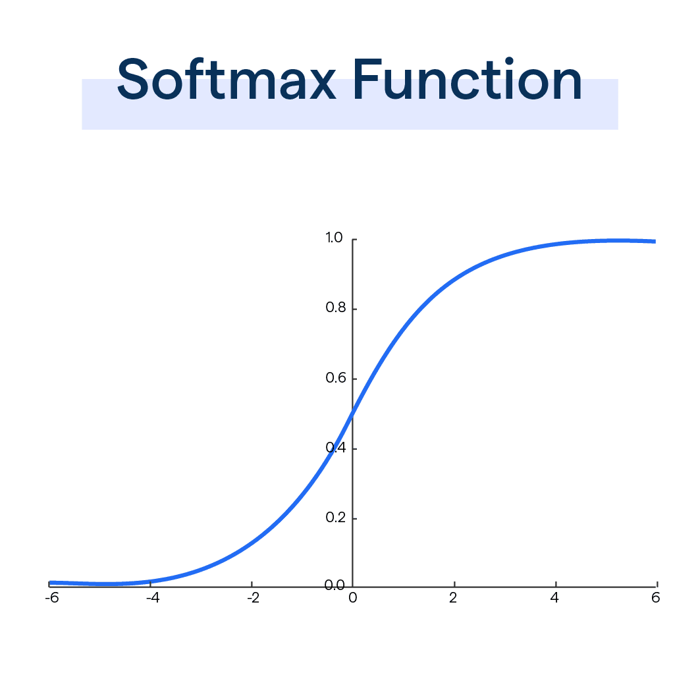

Also ensure result is positive

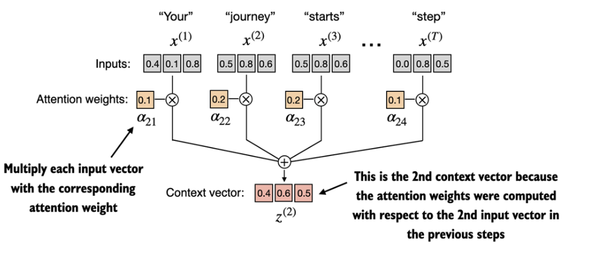

Calculatin vector z(2) by multiplying the embedded input tokens x(i) with the attention weights and then summing the resulting vectors

### 3.3.2 : All Weights togethers 

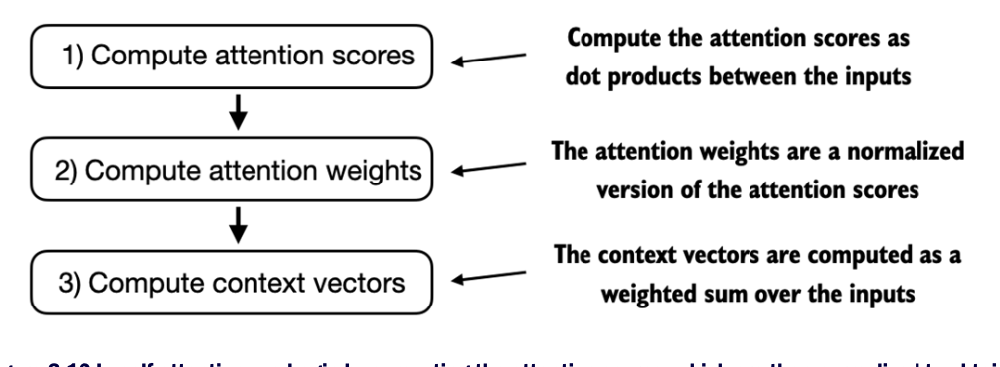


Step 1 : Compute Attention Scores
-> Compute dot product of inputs against each others
Step 2 : Compute Attention Weights
-> Normalization
Step 3 : Compute context vectors
-> Weighted sum over the inputs


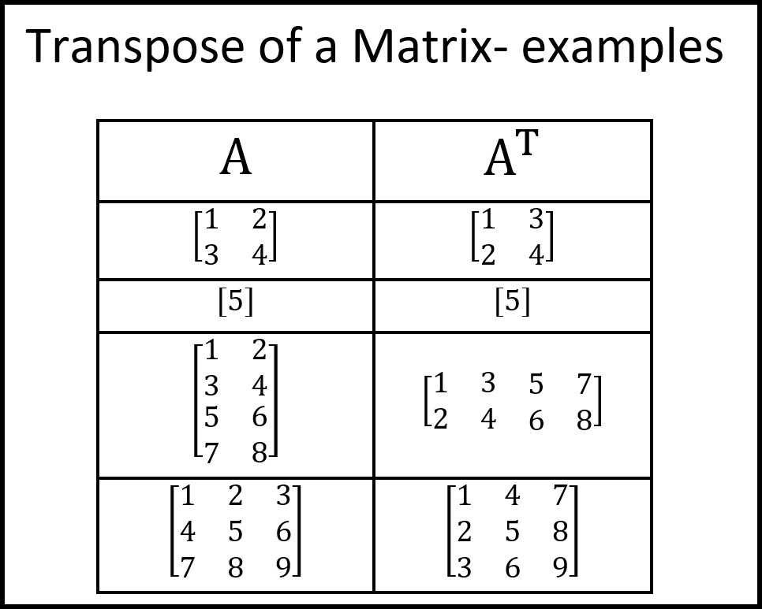

Attention Scores: 

Multiplication by transpose

`inputs @ inputs.T`

Steps :
```
attn_scores = inputs @ inputs.T
attn_weights = torch.softmax(attn_scores, dim=-1) 
all_context_vecs = attn_weights @ inputs
all_context_vecs
```

When doing matrix multiplication, ouput of is of size rows of first column by number of columns of second matrix

## 3.4 Self Attention with trainable weights

Also called `scalde dot-product attention`

Trainable weights are key as they are crucial for the model to learn how to produce "good" context

Introducing trainable weights matrices 

```
Wq -> query
Wk -> key 
Wv -> value 

```

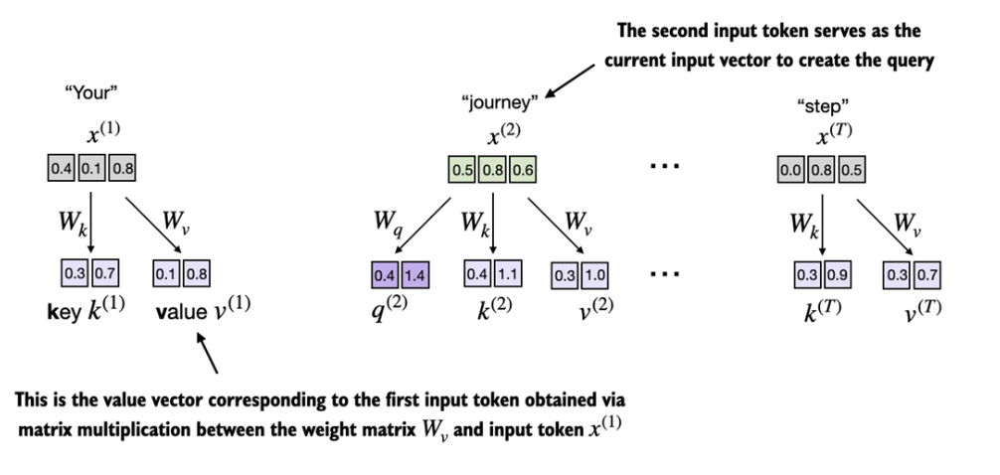

Query vector q(2) is computed with ` x(2) @ Wq ` or ` Wq @ x(2)`
Key Vector k(1) is computed with ` x(1) @Wk`
Value vector v(1) is computed with ` x(1)@Wv`

Note : Vector size changed (3 -> 2), but for GPT-like models, input and outputs dimensions usually remains the same. 

```
query_2 = x_2 @ W_query 
key_2 = x_2 @ W_key 
value_2 = x_2 @ W_value
```

Size : (1, 2) = (1,3)@(3,2)

⚠️ Weight Parameters vs Attention Weights
W is Weight Paramerts, optimized during NN training
Attention eights determine the extend to which a context vector depends on the different part of the input.

Weight Parameters : Fundamental, learned coefficients that define the network connections.
Attention weights : Dynamic, context-specific values, related to input.


```
keys = inputs @ W_key
values = inputs @ W_value

```

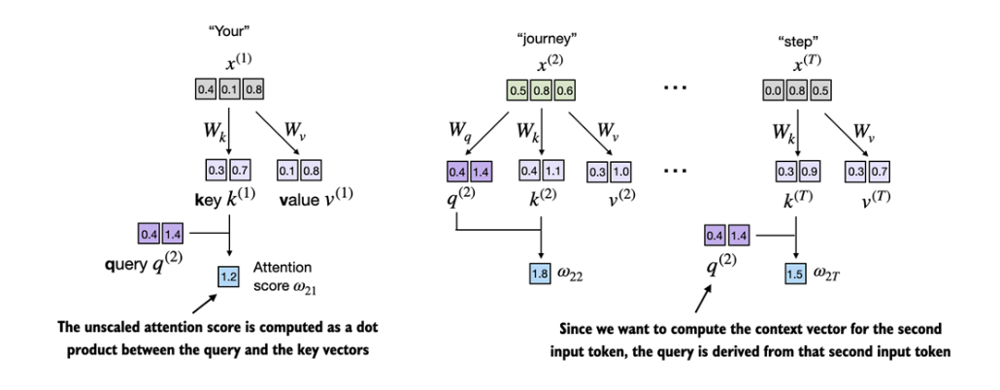

Computing attention score
Dot product computation, similar to simple self attention but this time instead of computing 
`attn_scores = inputs @ inputs.T`
we use the the query and key obtained by transforming inputs via respective weights matrices 

`attn_scores = query @ keys.T`

Note :

Dot product is defined between two vectors of same lengths . Matrix product is defined between two matrices. 


Then we get the attention weight by scaling with softmax, but we now scale the attention scores by diving them by the square root of the embedding dimension of the key (here it's 2).
-> improve training performance by avoiding small gradients.
-> larger embeddings (>12K GPT-3), results in very small gradients during backprop due to softmax. With dot product increase, softmax function behaves like a step function, gradient goes near zero.

Computing context vector 

`context_vector = attn_scores @ values`


#### Why Query, Key and Value ?

-> Analogy to Information Retrieval and Databases
 -> Store, Search, Retrieve

 Query : Search
 Key : Store 
 Value : Retrieve

Query -> Analogous ot a Search Query, current item.
Key -> database key used for indexing and searching.
Value -> Similar to key-value, once the model determines which keys are most matching the query, retrieves the values.

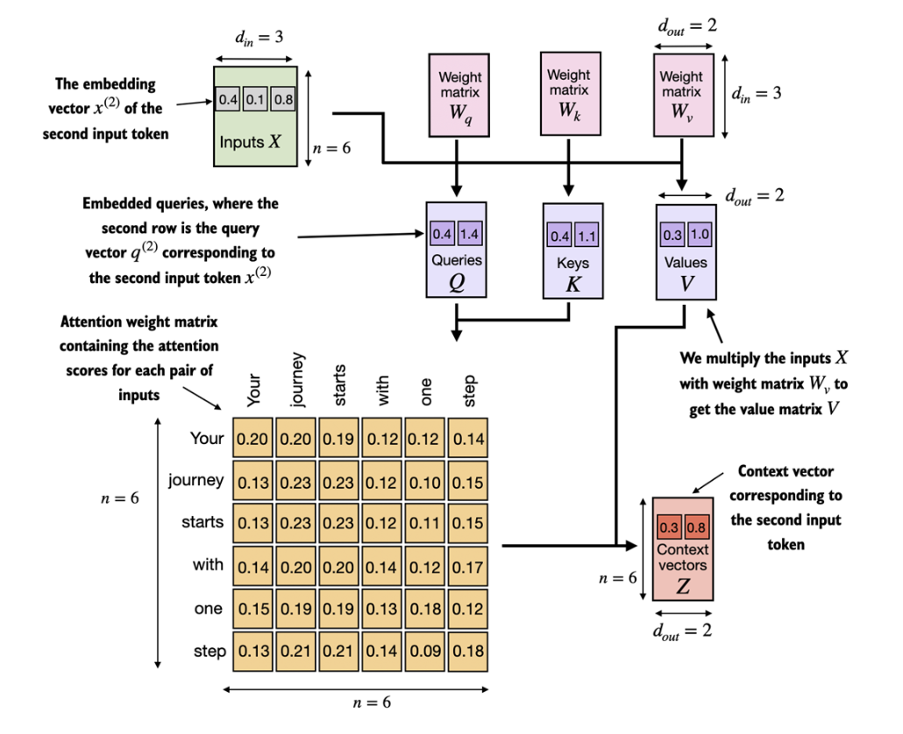


```python
       queries = input @ self.W_query
        keys = input @ self.W_key
        values = input @ self.W_value
        attn_scores = queries @ keys.T
        attn_weights = torch.softmax(attn_scores/self.d_out**0.5, dim = -1)
        context_vec = attn_weights @ values
```

### 3.5 Hiding Future words with Causal Attention

- Causal Attention, aka Masked Attention

Restrict model to only consider previous and current inputs in sequence

- We mask weight above diagonal and recompute such that hte attention weights sums to 1 for each row (=input)

#### 3.5.2 Dropout

- Used only during training, to avoid overfitting
- Random
- In GPT-2, but not so used anymore
